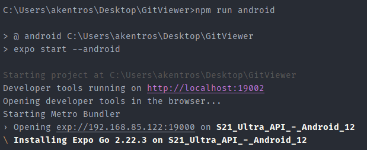
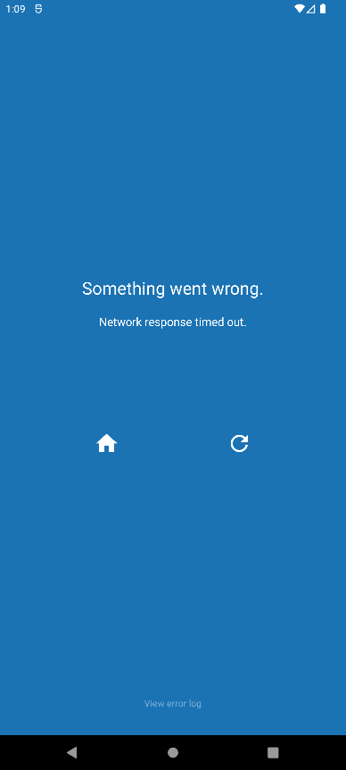
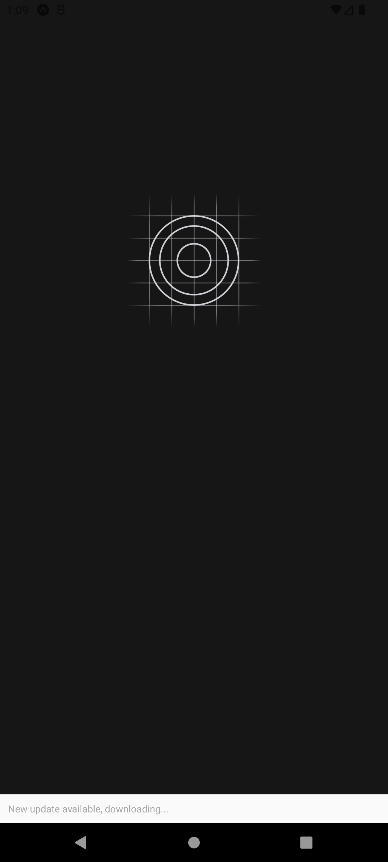
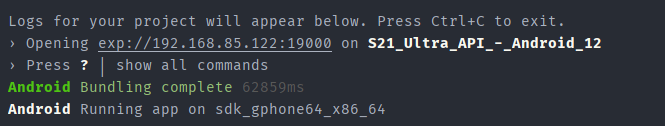

# Manual

How to run the application .

1) Install Node.js  ( 14.17.0 ) on your system

You can also use NVM so you can have multiple node.js versions on your system ( https://github.com/coreybutler/nvm-windows/releases/tag/1.1.8 )

2) Install expo-cli
   ` npm install expo-cli --global`
3) Install Android Studio and setup an emulator
4) From inside the project run `npm run android`

The first time the project will run it will install expo client

If the first time if fails and it displays this 

Press try again 

Wait for the bundle to complete 

And tada !!!

For any questions please ask : )
